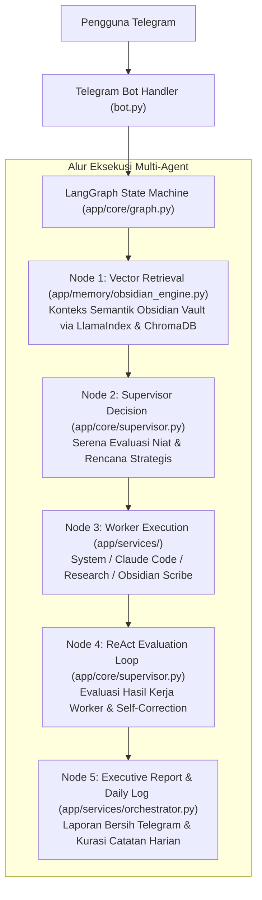
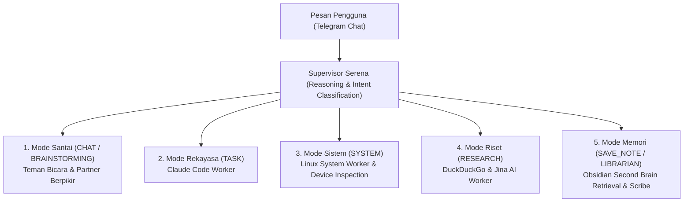

# Serena bot
*(LangGraph Multi-Agent System with Claude Code & Obsidian Second Brain)*

Serena bukan sekadar bot perintah koding, melainkan **Partner Berpikir (*Thinking Partner*)** sekaligus **Manajer Eksekutif Sistem (*One-Person Company Conductor*)**. 

Dirancang dengan arsitektur 5 pekerja spesialis (*Supervisor Serena, Linux System Worker, Claude Code Worker, Research Worker, dan Divisi Memori Obsidian*), Serena mampu beradaptasi secara mulus antara obrolan santai, tugas rekayasa kode berat, inspeksi kondisi perangkat keras/OS, riset web, hingga pengarsipan pengetahuan harian.

---

## 1. Arsitektur & Cara Kerja Sistem



---

## 2. Buku Panduan 5 Mode Niat (*The 5 Interaction Modes*)

Anda tidak perlu menghafal sintaks kaku untuk berinteraksi dengan Serena. Cukup sampaikan maksud Anda secara wajar dalam bahasa Indonesia. Serena akan mengklasifikasikan niat (*intent*) Anda secara otomatis ke dalam salah satu dari 5 mode berikut:



---

### Mode 1 : Santai & Bertukar Pikiran (`CHAT` / `BRAINSTORMING`)
* **Peran Serena** : Teman bicara yang hangat, suportif, empatik, dan partner berpikir untuk solo founder/developer.
* **Karakter Respon** : Dibalas secara alami dan langsung dengan indikator mengetik biasa di Telegram. **Tidak ada balon status proses robotik**, tidak menyentuh terminal Linux, dan tidak memanggil Claude Code.
* **Contoh Pertanyaan / Pemicu** :
  - *"Halo Serena, malam ini santai dulu yuk. Menurutmu ngoding seharian ini enaknya diimbangi apa?"*
  - *"Serena, capek juga ya ngoprek SWE-bench tadi. Kamu kalau lagi senggang biasanya mikirin apa?"*
  - *"Aku lagi ada ide iseng bikin aplikasi automasi, tapi konsepnya masih mentah. Mau bantu brainstorming?"*

---

### Mode 2 : Serius & Tugas Rekayasa Kode (`TASK`)
* **Peran Serena** : Tech Lead & Senior Software Engineer yang teliti, linear, dan berorientasi hasil.
* **Karakter Respon** : Balon status dinamis real-time muncul tanpa emoji (`*Sedang Diproses* (X detik)`), Claude Code mengeksekusi analisis berkas/perintah terminal, evaluasi ReAct mandiri memverifikasi hasil, dan laporan eksekutif disajikan dengan satu blok kode `bash` yang terpadu.
* **Contoh Pertanyaan / Pemicu** :
  - *"Tolong bedah struktur kode pada repositori SWE-bench. Periksa berkas setup.py atau pyproject.toml dan jelaskan cara kerja modul evaluation harness."*
  - *"Buatkan berkas script_parser.py untuk membaca keluaran JSONL dan ekstraksi error log."*
  - *"Perbaiki bug fungsi autentikasi pada auth_service.py agar menangani token kedaluwarsa."*

---

### Mode 3 : Operasi & Inspeksi Sistem Perangkat (`SYSTEM`)
* **Peran Serena** : DevOps Engineer & System Administrator kilat (< 1 detik).
* **Karakter Respon** : Dieksekusi secara instan oleh *Linux System Worker* menggunakan utilitas native Linux, bebas dari overhead AI koding, dan disaring agar tidak mengotori catatan harian Obsidian.
* **A. Inspeksi Kondisi Perangkat & OS** :
  - *"Cek kondisi perangkat: bagaimana penggunaan RAM, beban CPU, dan sisa kapasitas penyimpanan disk saat ini?"*
  - *"Periksa kontainer Docker apa saja yang sedang aktif berjalan di mesin ini."*
  - *"Periksa port apa saja yang sedang mendengarkan koneksi (listening ports)."*
* **B. Operasi Sistem & Proyek** :
  - *"Tolong siapkan proyek baru dari https://github.com/user/project.git dengan konfigurasi .env: PORT=8080"*
  - *"Jalankan perintah docker compose up -d di folder socratesv-project."*

---

### Mode 4 : Riset Web & Investigasi Industri (`RESEARCH`)
* **Peran Serena** : Peneliti teknologi & analis komparatif yang objektif.
* **Karakter Respon** : Menggunakan *Research Worker* (DuckDuckGo Search & Jina AI Reader) untuk mencari informasi daring terpercaya, membandingkan fakta, dan memberikan rekomendasi tindakan yang relevan.
* **Contoh Pertanyaan / Pemicu** :
  - *"Tolong riset apa perbedaan mendasar antara SWE-bench Lite dengan SWE-bench Verified, dan mengapa komunitas merekomendasikan Verified?"*
  - *"Cari dokumentasi resmi fitur terbaru LangGraph v0.2 terkait conditional edges."*

---

### Mode 5 : Memori & Second Brain (`SAVE_NOTE` / `LIBRARIAN`)
* **Peran Serena** : Pustakawan pribadi & kurator pengetahuan terstruktur.
* **Karakter Respon** : Mengambil konteks dari 5 folder Obsidian (`Proyek Aktif`, `Panduan & SOP`, `Catatan Harian`, `Kotak Masuk`, `Profil & Keputusan`) atau menyimpan lembar kerja baru lengkap dengan *bi-directional WikiLinks*.
* **Contoh Pertanyaan / Pemicu** :
  - *Mengingat Catatan Lama* : *"Serena, coba ingat-ingat apa yang pernah kita catat mengenai arsitektur SWE-bench?"* atau *"Kemarin di catatan harian kita bahas apa saja?"*
  - *Menyimpan Pengetahuan Baru* : *"Rangkum hasil diskusi evaluasi lokal tadi dan simpan sebagai dokumen SOP di Panduan & SOP Obsidian."* atau *"Simpan ide aplikasi ini ke Kotak Masuk."*

---

## 3. Panduan Peralihan Niat Secara Mendadak (*Sudden Intent Switching*)

Anda bebas melompat dari satu mode ke mode lainnya secara spontan dalam satu ruang obrolan tanpa perlu mereset bot. Serena menjaga riwayat percakapan secara multi-turn:

```text
[Anda]   : Tolong bedah repositori SWE-bench dan jelaskan arsitekturnya. (Mode 2: Rekayasa)
[Serena] : [Menampilkan status dinamis -> menyajikan Laporan Eksekutif Bedah Kode]

[Anda]   : Wah mantap. Santai dulu yuk Serena, malam ini lumayan capek. (Mode 1: Santai)
[Serena] : [Langsung membalas ramah tanpa balon status, merespon kelelahan Anda]

[Anda]   : Ngomong-ngomong mesin laptopku agak panas nih, tolong cek kondisi RAM & CPU sekarang. (Mode 3: Inspeksi Perangkat)
[Serena] : [Menjalankan free -h & uptime instan -> menyajikan laporan status hardware]

[Anda]   : Serena, coba ingat-ingat tadi di berkas SOP apa perintah CLI untuk menjalankan evaluasi? (Mode 5: Memori)
[Serena] : [Membaca berkas SOP di Obsidian -> menyebutkan baris perintah spesifik]
```

---

## 4. Perintah Kontrol Cepat (*Slash Commands*)

| Perintah | Fungsi |
| :--- | :--- |
| `/start` | Memulai interaksi dan menerima sapaan ramah kontekstual sesuai waktu (pagi/siang/malam). |
| `/status` | Memeriksa kesiapan sistem (Model AI, Claude CLI, Direktori Kerja, dan Obsidian Vault). |
| `/reset` | Mengosongkan ingatan riwayat percakapan jika ingin memulai topik obrolan baru dari nol. |
| `/cwd` | Melihat lokasi direktori kerja aktif atau mengubahnya (`/cwd ~/nama_folder`). |
| `/help` | Menampilkan panduan ringkas navigasi bot. |

---

## 5. Panduan Instalasi & Persiapan Lingkungan

### 1. Kloning & Virtual Environment
```bash
cd ~/projects/claude-telegram
python3 -m venv venv
source venv/bin/activate
pip install -r requirements.txt
```

### 2. Konfigurasi Berkas `.env`
Buka atau buat berkas `.env` di direktori proyek. Gunakan tanda tilde (`~`) untuk jalur direktori agar portabel di mesin manapun:

```env
# Token Bot Telegram dari @BotFather
TELEGRAM_BOT_TOKEN=your_telegram_bot_token_here

# ID Telegram Akun Anda dari @userinfobot
ALLOWED_USER_ID=your_telegram_user_id_here

# Direktori kerja bot (gunakan ~ untuk home directory)
WORKSPACE_DIR=~/projects/claude-telegram

# Root Agent Workspace (tempat proyek dan repositori hasil kerja agent disimpan)
SERENA_PROJECTS_DIR=~/serena-projects

# Lokasi Obsidian Vault (Second Brain)
OBSIDIAN_VAULT_DIR=~/obsidian_vault

# Konfigurasi OpenAI-Compatible API (Orchestrator AI Model)
OPENAI_API_KEY=your_openai_api_key_here
OPENAI_BASE_URL=https://api.openai.com/v1
OPENAI_MODEL=gpt-4o-mini
```

---

## 6. Menjalankan Bot

### Mode Standar (Produksi):
```bash
python bot.py
```

### Mode Pengembangan (Auto-Restart saat Ada Perubahan Kode):
```bash
watchfiles --filter python "python bot.py"
```
